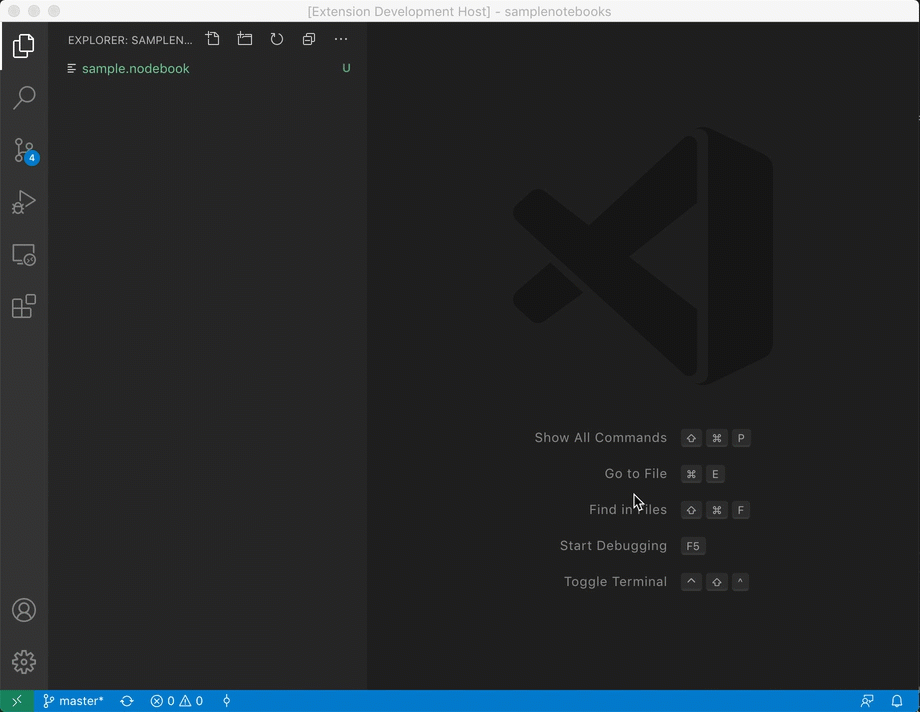

# Debugging in a JavaScript Notebook

A sample Javascript notebook that supports debugging.

The main focus of this sample is to show how to implement notebook debugging functionality based on existing VS Code debugger extensions.

In detail the sample shows how to:
- run (evaluate) notebook cells without debugging,
- intercept DAP messages in order to map back and forth between VS Code's notebook cells and the cell representation used by the underlying Node.js runtime.


## Running the sample

We assume that you have already cloned this repository, ran `yarn` and opened the project in VS Code.

Pressing **F5** opens another VS Code window with a project folder containing a sample notebook.

In order to debug cells you can enable debug mode by pressing the "bug" action in the editor's toolbar.
This makes the breakpoint gutter available where you can set breakpoints.
When you now evaluate cells, breakpoints will be hit and you can inspect variables in VS Code's usual debugger views and panes.




## Implementation Notes

These notes cover only the debugging functionality of the notebook implementation which lives mostly in the source file [`nodeKernel.ts`](https://github.com/microsoft/vscode-nodebook/blob/master/src/nodeKernel.ts).

A notebook is a structured document and the individual cells are not directly available for typical debuggers because they expect the code in files on disk or as interactive input when in REPL ([Read–eval–print loop](https://en.wikipedia.org/wiki/Read–eval–print_loop)) mode.

In this sample we are using a Node.js runtime in REPL mode as the notebook's kernel. The following snippet from `nodeKernel.ts` shows how Node.js is started with debugging turned on in REPL mode (where it expects to receive input via stdin):

```ts
  this.nodeRuntime = cp.spawn('node', [
    `--inspect=${this.debugPort}`,
    `-e`, `require('repl').start({ prompt: '', ignoreUndefined: true })`
  ])
```

Sending the cell contents to the Node.js REPL for evaluation has one problem: the REPL expects single lines whereas notebooks cell have multiple lines. Not only does this result in syntax errors but it is also difficult to get reliable breakpoints with this approach.

We work around this problem by using the REPL's `.load <filename>` directive which loads the code from the given file and then executes it. But this approach requires that we have to dump the cell's content into a temporary file before we can run the `.load <filename>` directive:

```ts
  public async eval(cell: vscode.NotebookCell): Promise<string> {

    const cellPath = this.dumpCell(cell.uri.toString());
    this.nodeRuntime.stdin.write(`.load ${cellPath}\n`);

    // collect output from node.js runtime

    return output;
  }
```

The `NodeKernel.dumpCell` utility checks via the scheme whether the URI denotes a notebook cell and then stores the cell's content in a temporary file. In addition the association between this file and the notebook cell is kept in a dictionary (`pathToCell`):

```ts
  private pathToCell: Map<string, vscode.NotebookCell> = new Map();

  private dumpCell(uri: string): string | undefined {
    try {
      const cellUri = vscode.Uri.parse(uri, true);
      if (cellUri.scheme === 'vscode-notebook-cell') {
        // find cell in document by matching its URI
        const cell = this.document.cells.find(c => c.uri.toString() === uri);
        if (cell) {
          const cellPath = `${this.tmpDirectory}/nodebook_cell_${cellUri.fragment}.js`;
          this.pathToCell.set(cellPath, cell);

          let data = cell.document.getText();
          data += `\n//@ sourceURL=${cellPath}`;	// trick to make node.js report the eval's source under this path
          fs.writeFileSync(cellPath, data);

          return cellPath;
        }
      }
    } catch(e) {
    }
    return undefined;
  }
```

With these preliminaries it is possible to evaluate cells, but source breakpoints will not yet work. Here is why:
VS Code manages (source) breakpoints autonomously from debuggers by keeping the source document's URI and line and column information. When a debug session starts, VS Code registers breakpoints by sending this data to the debug extension. When a breakpoint is hit the debug extension is expected to send the actual location back to VS Code as document URIs and line and column information.

The same holds for notebooks where each cell has its own document with its own cell URI. So notebook cell breakpoints are just like regular breakpoints.

Because we store the cell contents in temporary files before the debugger sees them, we need to replace the cell URI of a breakpoint by the path of the corresponding temporary file when talking to the debugger. And when a breakpoint is hit, we need to replace the file paths in the location information by the original cell URIs.

These transformations can be easily achieved by use of the [`vscode.DebugAdapterTracker`](https://github.com/microsoft/vscode/blob/3f43f45303c9433cf2a6422a6e61215e0631919d/src/vs/vscode.d.ts#L10843-L10871) which has full access to the DAP based communication between VS Code and the debug adapter. The tracker's `onWillReceiveMessage` is called for all DAP messages from VS Code to the debug adapter, and `onDidSendMessage` is called for all DAP messages from the debug adapter back to VS Code.
A `DebugAdapterTracker` can be created and installed for a debug session by means of a factory object which is registered for a specific debug type.

In the Nodebook sample the factory is registered on extension activation for all JavaScript/Node debugger types in [nodebookProvider.ts](https://github.com/microsoft/vscode-nodebook/blob/master/src/nodebookProvider.ts) with code that tries to find the corresponding NodeKernel for the debug session and then delegates the creation of the tracker to it:

```ts
  vscode.debug.registerDebugAdapterTrackerFactory('node', {
    createDebugAdapterTracker: (session: vscode.DebugSession): vscode.ProviderResult<vscode.DebugAdapterTracker> => {
      const kernel: NodeKernel = ...
      if (kernel) {
          return kernel.createTracker();
      }
      return undefined;
    }
  });
```

For the actual tranformation we have to find all places in the DAP protocol where file paths or URIs are used. These places are all represented by the `DebugProtocol.Source` interface and the visitor function `visitSources` can be used to "visit" those places and perform the mapping. Since the `visitSources` function depends heavily on the DAP specification, it should really live in the corresponding DAP npm module, but for now this sample just contains a copy (that might get out of date over time).

Here is the Nodebook sample tracker that converts cell URIs to tmp file paths and vice versa:
```ts
  public createTracker(): vscode.DebugAdapterTracker {

    return {

      onWillReceiveMessage: (m: DebugProtocol.ProtocolMessage) => {
        // VS Code -> Debug Adapter
        visitSources(m, source => {
          if (source.path) {
            const cellPath = this.dumpCell(source.path);
            if (cellPath) {
              source.path = cellPath;
            }
          }
        });
      },

      onDidSendMessage: (m: DebugProtocol.ProtocolMessage) => {
        // Debug Adapter -> VS Code
        visitSources(m, source => {
          if (source.path) {
            let cell = this.pathToCell.get(source.path);
            if (cell) {
              source.path = cell.uri.toString();
              source.name = PATH.basename(cell.uri.fsPath);
              // append cell index to name
              const cellIndex = this.document.cells.indexOf(cell);
              if (cellIndex >= 0) {
                source.name += `, Cell ${cellIndex + 1}`;
              }
            }
          }
        });
      }
    }
  }
```

In the direction from VS Code to the debug adapter (`onWillReceiveMessage`) we use the `dumpCell` method again because it will ensure that the cell's content is dumped to a temporary file before the path to this file is used to patch the source object.

In the other direction (`onDidSendMessage`) the dictionary is used to find the notebook cell for a given file path. If successfull, the source object is patched with the cell's URI and the display name of the source is set to the notebook's base name followed by the cell's index within the notebook.
